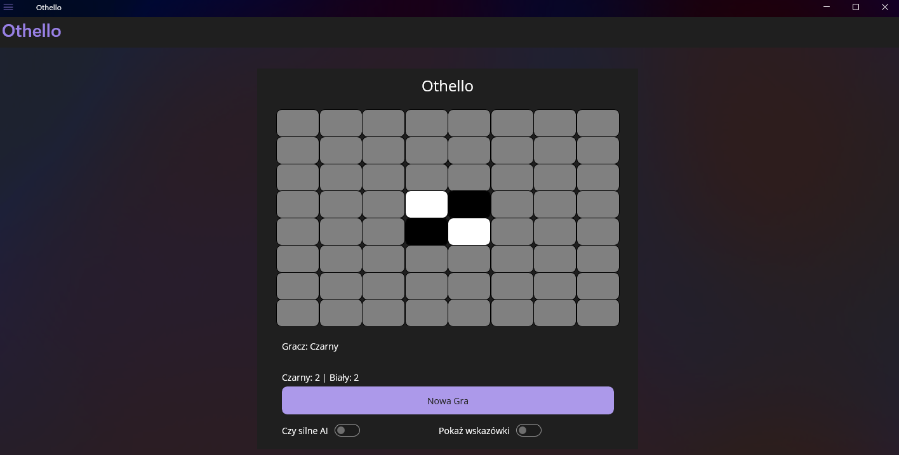
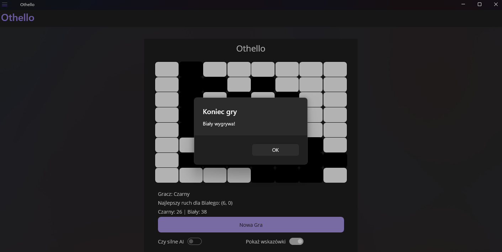

# Othello AI

Othello (also known as Reversi) is a classic two-player strategy board game. This project is a desktop version of Othello built with .NET MAUI and includes a basic AI opponent with adjustable difficulty.

## Features

- Player vs AI gameplay (you always play as White player)
- Optional strong AI mode
- Move hint system
- Simple and clean UI

### Standard AI
The AI chooses one of the valid moves at random. This mode is fast and provides an easier challenge for beginners.

### Strong AI (Minimax with Alpha-Beta Pruning)
The strong AI uses the Minimax algorithm with alpha-beta pruning to choose the best possible move.

- The AI acts as the **maximizing player**.
- Possible player responses (hints) are evaluated as **minimizing moves**.
- The algorithm simulates game states 5 moves ahead.
- Alpha-beta pruning skips branches that won't affect the final decision, improving performance.

Evaluation is based on:
- Number of discs
- Corner control
- Mobility
- Board position weight map

## How to Play

- Click on any highlighted tile to place a disc.
- Turns alternate between the player and the AI.
- Use the **New Game** button to reset the board.
- Toggle **Strong AI** for increased difficulty.
- Toggle **Show Hints** to display legal moves.

## Requirements

- Windows 10+ with .NET 9 SDK (MAUI-supported)
- Visual Studio 2022 or newer with MAUI workload installed